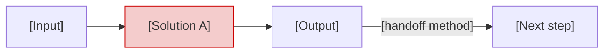
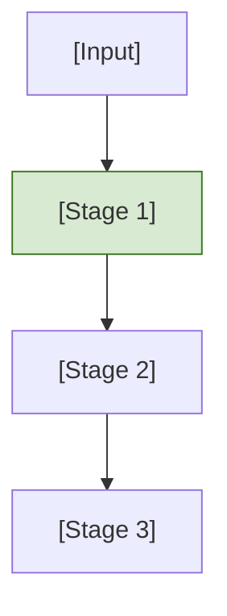

# Architectural comparison: [Solution A] vs [Solution B]

- **Status:** Draft
- **Last Updated:** YYYY-MM-DD
- **Classification:** Internal research
- **Authors:** [Team name] under human supervision

---

## 1. Executive summary

This document evaluates whether [Solution A] should replace, complement, or be rejected in favor of [Solution B] for [domain/purpose].

**Evaluation scope:** [Clarify what is being compared. Correct false equivalences. If one solution covers multiple stages of the other's pipeline, state that here.]

**Finding:** [Neutral factual summary. Describe the structural relationship between the solutions without recommending.]

**Recommendation:** [Decisive action. "Retain Solution B. Do not adopt Solution A." Include key numbers: weighted scores, cost multiplier, primary structural reasons.]

---

## 2. Scope and methodology

### 2.1 Evaluation scope

| Dimension       | In scope                           | Out of scope                         |
| --------------- | ---------------------------------- | ------------------------------------ |
| **Solution A**  | [specific product/version/feature] | [related products not evaluated]     |
| **Solution B**  | [specific components/stages]       | [related components referenced only] |
| **Environment** | [platforms, tools, infrastructure] | [platforms not used]                 |

### 2.2 Methodology

1. Product analysis of [Solution A] via official documentation, product pages, blog posts, and press coverage
2. Architecture review of [Solution B] including [specific artifacts reviewed]
3. Evaluation against weighted criteria derived from the organization's operational requirements
4. Risk assessment using standard probability/impact classification

### 2.3 Key assumptions

- [Assumption 1: organizational context that, if false, changes the analysis]
- [Assumption 2]
- [Assumption 3]

### 2.4 Limitations

- [Limitation 1: what was not tested, what is uncertain]
- [Limitation 2]
- [Limitation 3]

---

## 3. Solution profiles

### 3.1 [Solution A name]

**Type:** [Cloud SaaS | Local tool | Framework | Library]
**Launch:** [Date and maturity: beta, GA, version]
**Vendor:** [Company name, funding stage, relevant context]

**Mechanism:** [2-4 sentences describing how it works at a high level.]

**Output structure:**

| Section     | Content                      |
| ----------- | ---------------------------- |
| [Section 1] | [What this section contains] |
| [Section 2] | [What this section contains] |
| [Section 3] | [What this section contains] |

**Handoff:** [How output reaches the next step in the workflow.]

**Generation time:** [Range estimate.]

**Integrations:** [Input sources and output targets.]

### 3.2 [Solution B name]

**Type:** [Match the same field structure as 3.1]
**Maturity:** [Match field]

**Mechanism:** [Match level of detail to 3.1.]

**Output structure:**

| Element     | Content                      |
| ----------- | ---------------------------- |
| [Element 1] | [What this element contains] |
| [Element 2] | [What this element contains] |
| [Element 3] | [What this element contains] |

**Handoff:** [Match field.]

**Generation time:** [Match field.]

**Integrations:** [Match field.]

---

## 4. Evaluation framework

### 4.1 Criteria and weights

| #   | Criterion        | Weight | Rationale                                                   |
| --- | ---------------- | ------ | ----------------------------------------------------------- |
| C1  | [Criterion name] | XX%    | [Why this weight, connected to organizational requirements] |
| C2  | [Criterion name] | XX%    | [Rationale]                                                 |
| C3  | [Criterion name] | XX%    | [Rationale]                                                 |
| C4  | [Criterion name] | XX%    | [Rationale]                                                 |
| C5  | [Criterion name] | XX%    | [Rationale]                                                 |
| C6  | [Criterion name] | XX%    | [Rationale]                                                 |
| C7  | [Criterion name] | XX%    | [Rationale]                                                 |
| C8  | [Criterion name] | XX%    | [Rationale]                                                 |

<!-- Verify: weights must sum to exactly 100% -->

### 4.2 Scoring

| Score | Meaning                                                      |
| ----- | ------------------------------------------------------------ |
| 5     | Fully meets requirement with clear advantage                 |
| 4     | Meets requirement well                                       |
| 3     | Adequate, no significant gaps                                |
| 2     | Partially meets requirement, notable gaps                    |
| 1     | Does not meet requirement or introduces significant problems |

### 4.3 Evaluation matrix

| #   | Criterion (weight) | Solution A                                | Score | Solution B                                | Score |
| --- | ------------------ | ----------------------------------------- | ----- | ----------------------------------------- | ----- |
| C1  | [Name] (XX%)       | [2-3 sentence evidence-based description] | **X** | [2-3 sentence evidence-based description] | **X** |
| C2  | [Name] (XX%)       | [Description with evidence]               | **X** | [Description with evidence]               | **X** |
| C3  | [Name] (XX%)       | [Description with evidence]               | **X** | [Description with evidence]               | **X** |
| C4  | [Name] (XX%)       | [Description with evidence]               | **X** | [Description with evidence]               | **X** |
| C5  | [Name] (XX%)       | [Description with evidence]               | **X** | [Description with evidence]               | **X** |
| C6  | [Name] (XX%)       | [Description with evidence]               | **X** | [Description with evidence]               | **X** |
| C7  | [Name] (XX%)       | [Description with evidence]               | **X** | [Description with evidence]               | **X** |
| C8  | [Name] (XX%)       | [Description with evidence]               | **X** | [Description with evidence]               | **X** |

### 4.4 Weighted scores

| Solution       | Calculation                                | Total    |
| -------------- | ------------------------------------------ | -------- |
| **Solution A** | (X x 0.XX) + (X x 0.XX) + (X x 0.XX) + ... | **X.XX** |
| **Solution B** | (X x 0.XX) + (X x 0.XX) + (X x 0.XX) + ... | **X.XX** |

[Solution B] scores X.XX / 5.00. [Solution A] scores X.XX / 5.00. [State what drives the gap: which criteria, what percentage of weight they carry, and why the scores diverge there.]

**Sensitivity check:** [Remove the highest-weighted criterion. Redistribute weight equally. State whether the winner changes and why.]

---

## 5. Architectural fit analysis

### 5.1 Integration topology

**[Solution A] -- proposed integration:**

Problems:

- [Problem 1]
- [Problem 2]

**[Solution B] -- current architecture:**

Properties:

- [Property 1]
- [Property 2]

### 5.2 Separation of concerns

[If the solutions differ in how they divide responsibility, analyze the trade-offs.]

| Component | Responsibility    | Does NOT do                 |
| --------- | ----------------- | --------------------------- |
| [Agent 1] | [WHAT it handles] | [What it explicitly avoids] |
| [Agent 2] | [WHAT it handles] | [What it explicitly avoids] |

[Analyze trade-offs of merging vs separating responsibilities. Cite research if relevant.]

### 5.3 Governance propagation

[If relevant: diagram how governance, rules, or constraints flow through each system.]

---

## 6. Total cost of ownership (3-year projection)

### 6.1 Cost model assumptions

- Team size: [N] developers
- Projects: [N] active repositories
- Usage: [N] plans/runs per month across all projects
- [Solution A] pricing: [tier] at [$/unit/period]
- [Solution B] pricing: [API costs per invocation]
- [Other relevant assumptions]

### 6.2 Three-year comparison

| Cost category            | Solution A (3 years)  | Solution B (3 years)  |
| ------------------------ | --------------------- | --------------------- |
| Subscription / API costs | $X x Y x Z = **$N\*\* | $A x B x C = **$M\*\* |
| One-time setup           | **$N**                | **$M**                |
| Maintenance (annual x 3) | **$N**                | **$M**                |
| **Total (3 years)**      | **~$TOTAL**           | **~$TOTAL**           |

The cost differential is approximately **Xx** over three years. [Note any exclusions.]

---

## 7. Risk assessment

### 7.1 Risk matrix

| Risk                       | Probability | Impact  | Solution   | Mitigation                           |
| -------------------------- | ----------- | ------- | ---------- | ------------------------------------ |
| **R1:** [Risk description] | [Level]     | [Level] | Solution A | [Specific, costed, owned mitigation] |
| **R2:** [Risk description] | [Level]     | [Level] | Solution A | [Mitigation]                         |
| **R3:** [Risk description] | [Level]     | [Level] | Solution B | [Mitigation]                         |

### 7.2 Risk assessment summary

[Solution A] carries [N] risks, with [N] rated [High/High]. [State whether these are structural or configurable.]

[Solution B] carries [N] risks, all rated [Medium or Low]. [Identify the primary concern and how it's addressed.]

---

## 8. Gap analysis

### 8.1 Capabilities [Solution A] has that [Solution B] lacks

| Capability               | Impact  | Addressable internally?                |
| ------------------------ | ------- | -------------------------------------- |
| [Capability description] | [Level] | [Yes/No/Partially -- with explanation] |
| [Capability description] | [Level] | [Explanation]                          |

### 8.2 Capabilities [Solution B] has that [Solution A] lacks

| Capability               | Impact  | Addressable by [Solution A]? |
| ------------------------ | ------- | ---------------------------- |
| [Capability description] | [Level] | [Yes/No -- with explanation] |
| [Capability description] | [Level] | [Explanation]                |

[Synthesis statement: "The asymmetry is clear: Solution B's gaps are addressable through internal improvements. Solution A's gaps are structural and cannot be addressed without redesigning the product."]

---

## 9. Improvement candidates inspired by [Solution A]

[Intro: "The following features from [Solution A] could strengthen the existing [Solution B] without introducing external dependencies. Each is scoped as a potential enhancement, not a current commitment."]

### 9.1 [Improvement name]

**Problem:** [What capability is missing from Solution B.]

**Proposed approach:** [Concrete approach to add the capability.]

**Effort estimate:** [Small | Medium | Large]. [One sentence explaining why.]

### 9.2 [Improvement name]

**Problem:** [Description.]

**Proposed approach:** [Approach.]

**Effort estimate:** [Level]. [Reasoning.]

---

## 10. Recommendation

### 10.1 Primary recommendation

**[Retain Solution B. Do not adopt Solution A.]**

[2-3 sentences with key evidence: scores, cost multiplier, structural gaps.]

### 10.2 Conditions that would change this recommendation

- [Condition 1: specific change that would flip the conclusion]
- [Condition 2]
- [Condition 3]
- [Condition 4]

[Closing: "None of these conditions currently apply."]

### 10.3 Recommended next steps

1. [Highest-priority action, referencing Section 9 improvements]
2. [Second priority]
3. [Third priority / deferred item]

### 10.4 Re-evaluation schedule

[Reassess Solution A in [timeframe] when [trigger event]. Evaluate whether [specific capabilities] have been added.]

---

## Appendix A: Sources

### [Solution A name]

- [Label](URL)
- [Label](URL)

### [Solution B name]

- [Label](URL)
- [Label](URL)

### Research

- [Author et al., "Title," Venue Year. [arXiv:XXXX.XXXXX](URL) -- Cited in Sections X, Y. [Relevance summary.]]

---

## Appendix B: Evaluation criteria weight justification

**C1 [Criterion name] (XX%):** [Why this weight. Why not higher. Why not lower. Connect to organizational context.]

**C2 [Criterion name] (XX%):** [Justification.]

**C3 [Criterion name] (XX%):** [Justification.]

**C4 [Criterion name] (XX%):** [Justification.]

**C5 [Criterion name] (XX%):** [Justification.]

**C6 [Criterion name] (XX%):** [Justification.]

**C7 [Criterion name] (XX%):** [Justification.]

**C8 [Criterion name] (XX%):** [Justification.]
