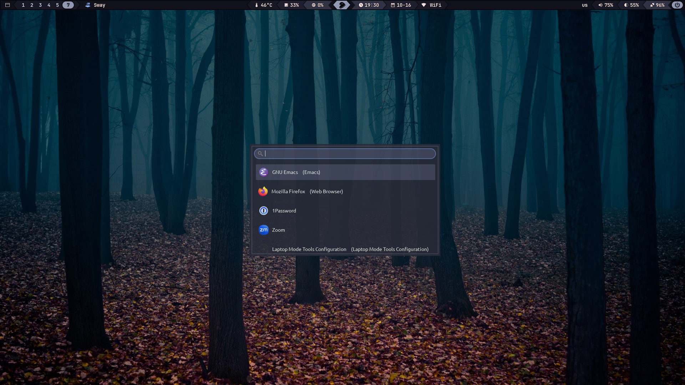

# `~/.*`

All my dotfiles that I port around from system to system. The goal of this project is to organize my shell scripts and configurations, and to keep them synchronized across multiple machines. It started as a basic setup, but now it includes management of `.bashrc`, `.bash_profile`, and various other shell-related files and tools.

## Supported OS

This repository is primarily intended for Linux workstations, though some configuration files and scripts are also compatible with macOS. Below is a list of the main Linux distributions where these dotfiles will be relevant and functional:

- Gentoo Linux
- Arch Linux
- Debian
- Ubuntu
- Fedora

## Shell support

These dotfiles are primarily designed for Bash, but many scripts and configurations are compatible with Zsh and other Bash-like shells. The shell should support colors and basic POSIX features for optimal behavior.

## Components

This repository is primarily a project where I store my personal configuration files. Some aspects may seem unusual to you, but ultimately, this is my setup to which I’m accustomed. It’s worth noting that I use Gentoo Linux as my main system and GNU Emacs as my primary text editor, so this configuration is built around that fact. Below are links to the projects that I also maintain:

- [GNU Emacs configuration](https://github.com/sergeyklay/.emacs.d): My personal configuration for GNU Emacs
- [Lenovo Y520 Setup](https://github.com/sergeyklay/lenovo-legion-y520-15ikbn): Gentoo configuration for Lenovo Y520 (Legion)

## Install

Many similar projects offer complex (in my humble opinion) systems for installing and bootstrapping configuration files. I find this to be an unnecessary complication that doesn’t add transparency and forces users to carefully review the installation scripts before running them. Finally, this would place an additional burden on me to maintain these scripts, including all the corner cases, which I consider an excessive price to pay. To utilize my configuration files, simply clone the repository and create symbolic links for what you need. I’ve been doing this for 11 years and plan to continue for the next 11.

## License

This project is open source software licensed under the [GNU General Public License version 3](https://github.com/sergeyklay/dotfiles/blob/main/LICENSE).
Copyright © 2014, 2015, 2016, 2017, 2018, 2019, 2020, 2021, 2022, 2023, 2024, 2025 Serghei Iakovlev.

### Note On Copyright Years

In copyright notices where the copyright holder is Serghei Iakovlev, then where a range of years appears, this is an inclusive range that applies to every year in the range. For example: 2019-2024 represents the years 2019, 2020, 2021, 2022, 2023 and 2024.
